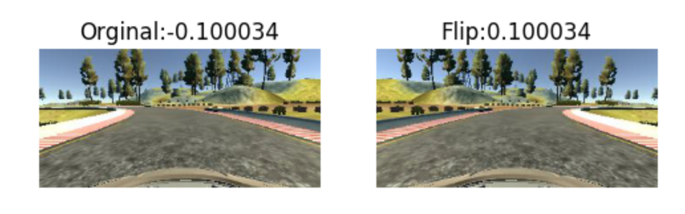

#**Behavioral Cloning Project**

The goals of this project are:
* Obtain simulator data for good driving behavior, in terms of images and what a good steering angle is for that image. 
* Using this data, build a convolution neural network based model in Keras that predicts steering angles from images.
* Train and validate the model with a training and validation set.
* Test that the model successfully drives around track one without leaving the road


[//]: # (Image References)

[image1]: ./images/model_architecture.png  "Model Architecture"


---

#### How to run the simulator
Using the Udacity provided simulator and my drive.py file, the car can be driven autonomously around the track by executing 
```sh
python drive.py model.h5
```

---

This project includes the following files:
* model.py containing the script to create and train the model
* drive.py for driving the car in autonomous mode
* model.h5 containing a trained convolution neural network 
* writeup_report.md summarizing the results
* behavioral_cloning.ipynb which visualizes the training in an eye pleasing way!


###Model Architecture and Training Strategy

####1. Model Architecture

* My model uses the [nVIDIA DAVE-2 architecture](http://images.nvidia.com/content/tegra/automotive/images/2016/solutions/pdf/end-to-end-dl-using-px.pdf) for this task of predicting steering values. A summary of the model architecture is as below:

![alt text][image1]

####2. Attempts to reduce overfitting in the model

* Being true to the DAVE-2 architecture, I didn't use dropout layer to reduce overfitting to training data. Instead, The model was trained and validated on different data sets to ensure that the model was not overfitting. The classic observation of overfitting - wherein the training error continues to reduce beyond a certain training epoch, but the validation error starts shooting up - was made and the epoch at which the validation error was the least was chosen as the final model. this model was then tested by running it through the simulator and ensuring that the vehicle could stay on the track.

####3. Model parameter tuning

* The model used an adam optimizer, so the learning rate was not tuned manually. As mentioned above, the number of epochs to which the model trains was monitored by comparing the trajectories of training error and validation error.

####4. Data

* Data was obtained from the simulator, by driving in the simulator to keep the car on the track! During training, the images were recorded with 3 cameras (center, left, and right) similar to exisiting practical self driving cars. But, the steering value input by the user is true for center image. so, to adjust to this steering value was adjusted for left and right images as they represent an entirely different scenario in terms what the image captures. From the Udacity forum, a best practice value of 0.2 was found to be good, and was used to adjust the steering values for the left(+0.2) and right(-0.2) images.This method makes the data more complete in terms of covering different scenarios at which the car can find itself to be heading out of the track. Visually this translates to images and steering angles as show in an example image below.


* Further, it is possible during training data collection that, one particular turn (either right or left turn) has more data, because of nature of the track. To compensate for this, I flipped the images horizontally and inverted the steering values, so as to produce artificial data which covers both left and right turn examples. Visually this translates to images and steering angles as show in an example image below.




####5. Training

* With the augmented data now covering all possible scenarios of staying on the track if driving correctly, and recovering to stay on the track if headed out of the track, The network was trained. The paper suggested certain preprocessing steps which were done in my implementation also. First is cropping the irrelevant parts of the image (which is top 1/3rd of the image and bottom 25 (approx.) pixels which removes the sky and bonnet of the car respectively (Both don't contribute to the learning process). Second, resize the images to 66x200 (height X width). Finally, one of the bestpractices of any NeuralNet training, the image data was normalized.
* Since, we don't use dropout layer, the data was split into training dataset and validation dataset after randomly rearranging the data (training works best if there is least correlation among successive examples). Using these datasets,a training epoch which produced the least validation error was chosen and the model was saved with the weights at the epoch(which is 5 in my case). The trained model was tested on the simulator by driving the car autonomously using the model. The car succesfully passed the test by staying on the track for the entire duration of test time (4-5 laps)! The video recording of the autonomous run can be found in this repository!!
